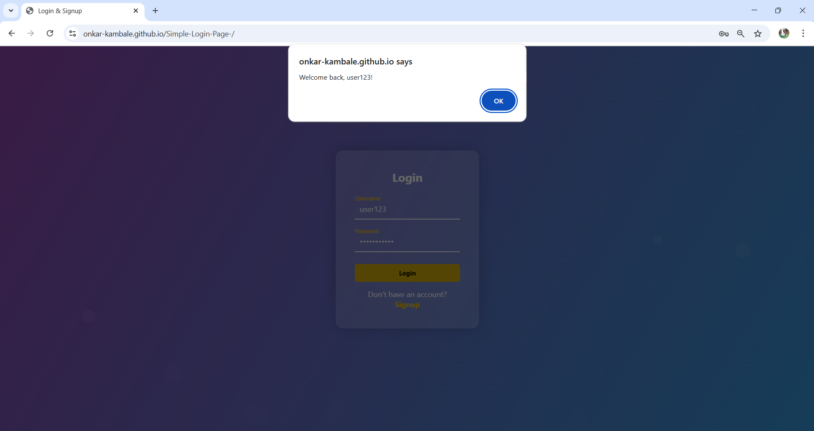

# 🔐 Animated Login & Signup Form

A beautiful and fully functional **Login & Signup Form** built using **HTML, CSS, and JavaScript**, featuring:

- 🎨 A modern and responsive glassmorphism design
- ✨ Animated floating background bubbles
- 🔄 Smooth toggle between Login and Signup
- ⚠️ Basic input validation

---

## 📸 Screenshot

---

## 🚀 Live Demo

https://onkar-kambale.github.io/Simple-Login-Page-/

---

## 📁 Project Structure

login-signup-form/
├── index.html # Main HTML file
├── style.css # All styles with animations and layout
├── script.js # Form logic, toggling, and validation
└── README.md # Project documentation

---

## 💡 Features

- Responsive design (mobile-friendly)
- Glass UI with background blur
- Animated background bubbles
- Login and Signup modes with toggling
- Input field animations
- Basic JS validation and interaction

---

## 🛠️ Tech Stack

- **HTML5** for structure
- **CSS3** for styling and animations
- **JavaScript** for logic and interactivity

---

## 📜 License

This project is open-source and available under the MIT License.
